# Content
{:.no_toc}

* content
{:toc}

# Character Creation
## General Creation
[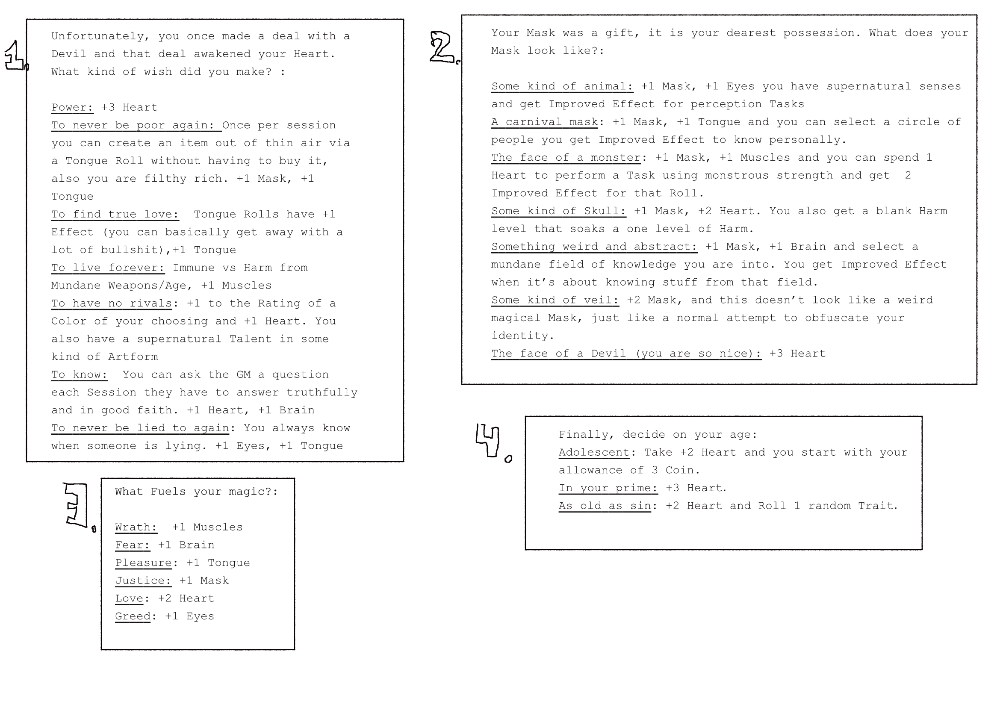](img/creation.png)
## Colors
Either choose 3 colors or roll a d20 4 times to get your colors. You know one shade for each of your colors. Aether strenghten your color and is mostly useless at character creation without another shade. Shades which start with "..." modify already available shades of the corresponding color

[*Click Here For The Color Overview*](#color-overview)

## Bonds
Choose 3 bonds
[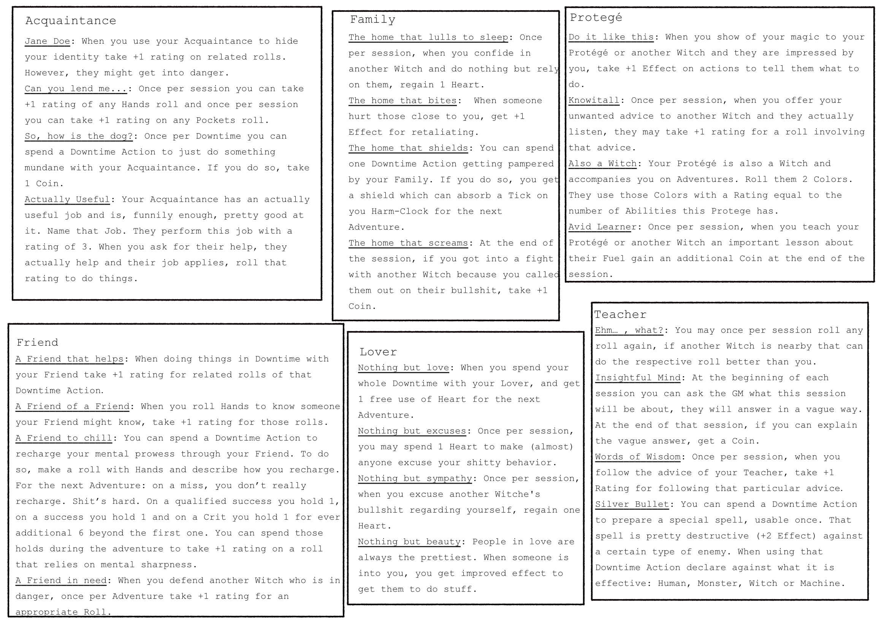](img/bonds.png)
## Coins/Heart
### Spending Coins
[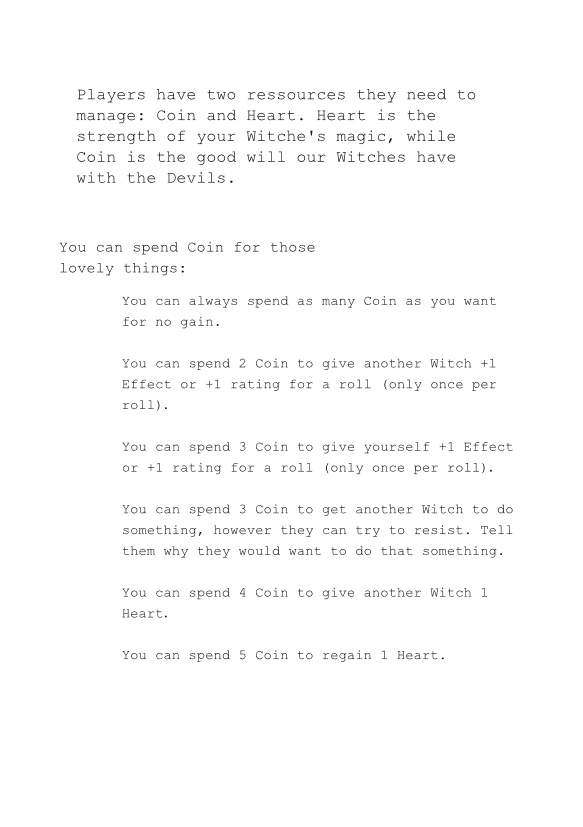](img/coins.png)
### Spending Heart
Comming soon
# End of Session
## Advancement
[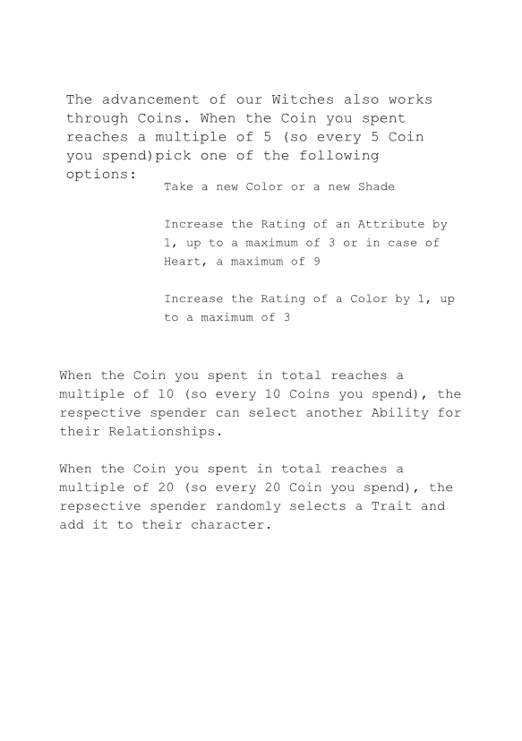](img/advancement.png)
## Coin Gain
[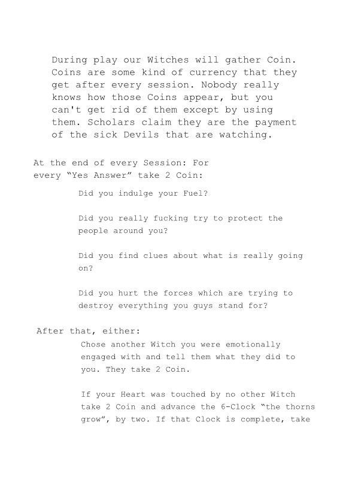](img/coin_gain.png)
# Color Overview

| D20 | Color | Shades |
| :---: | :-----: | :------: |
| 1 | Telekinetic | Manipulate/Force/Protect/Aether |
| 2 | Thought | Beliefs/Actions/Convictions/Aether |
| 3 | Emotions | Create Emotions/Manipulate Atmosphere/Impact/Aether |
| 4 | Blood | Heal/Hurt/Sense/Aether |
| 5 | Space | Portals/Blink/Journey/Aether |
| 6 | [Fate](#fate) | Accident/Coincidence/Luck/Aether |
| 7 | [Time](#time) | Slow Down/Quicken/Jump/Aether |
| 8 | Shapechange | More/Less/Special/Aether |
| 9 | Polymorph | Make Dangerous/Make Timid/... Do It Quick/Aether |
| 10 | Delusions | Illusions/Phenomena/Madness/Aether |
| 11 | Visions | See The Past/See The Future/See The Present/Aether |
| 12 | Hotness | Ignite/Control Fire/Control Lightning/Aether |
| 13 | Technology | Data/Electronics/Mechanics/Aether |
| 14 | [Undeath](#undeath) | Create/...Not So Slow/... With Names/Aether |
| 15 | Beasts | Call/Control/Empower/Aether |
| 16 | [Shadows](#shadows) | Animate Darkness/Shadow Door/Engulf/Aether |
| 17 | Dreams | Put To Sleep/Dive/Materialize/Aether |
| 18 | [Move](#move) | Fly/Float/Phase/Aether |
| 19 | Annihilation | Destroy One/... A Lot/... With Precision/Aether |
| 20 | [Snow](#snow) | Remove Heat/Shape Ice/Snowstorm/Aether |

## Fate
[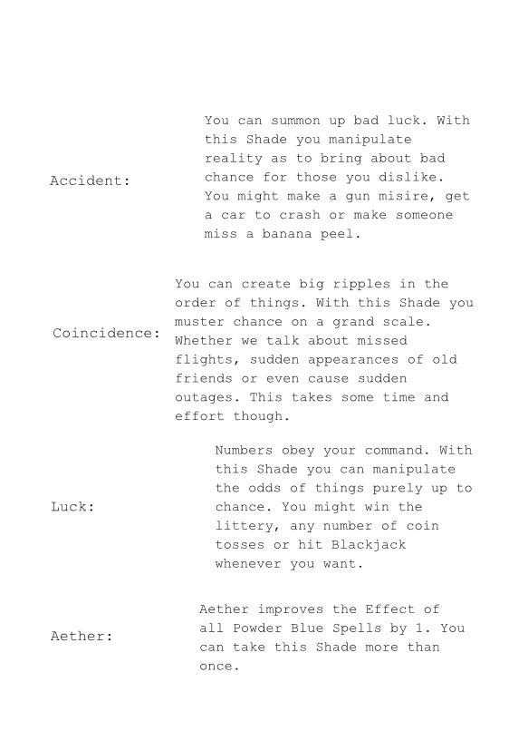](img/fate.png)
## Time
[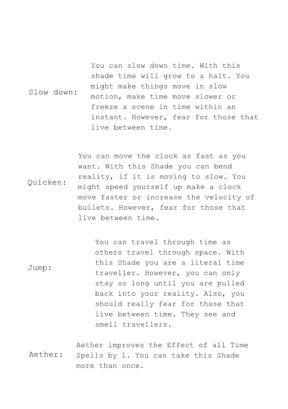](img/time.png)
## Shadows
[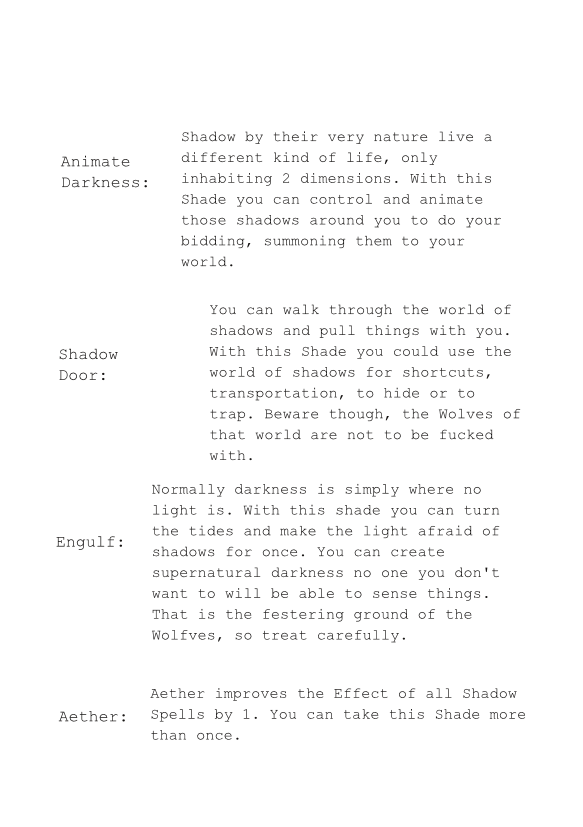](img/shadow.png)
## Snow
[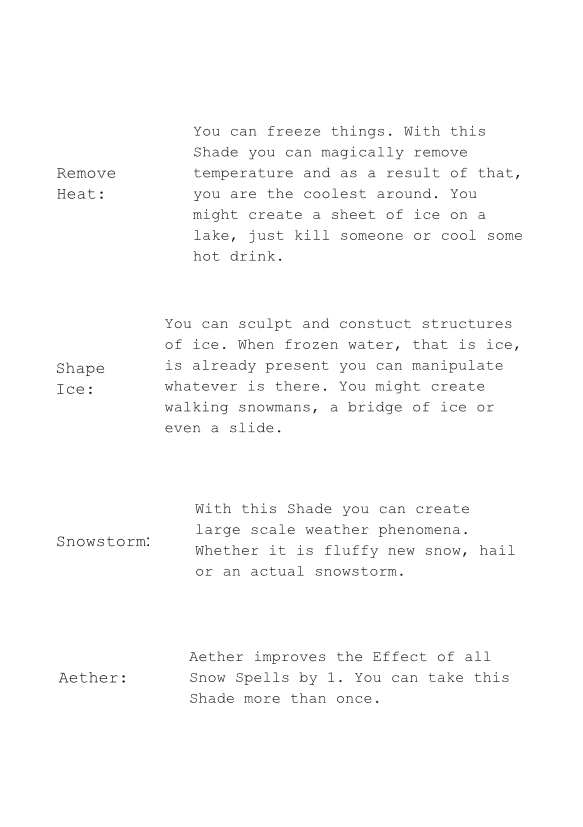](img/snow.png)
## Undeath
[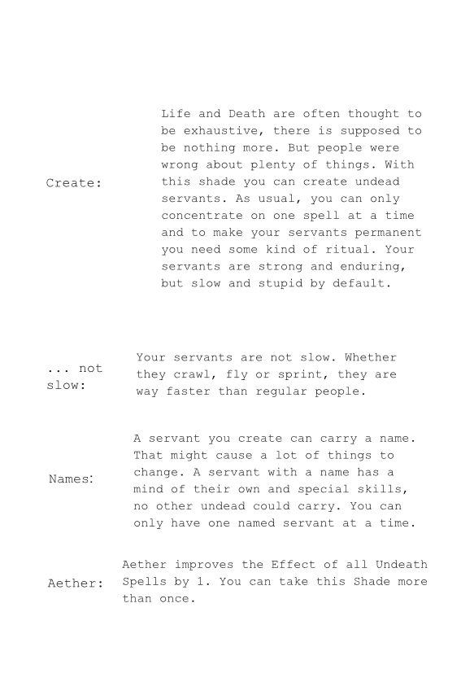](img/undeath.png)
## Move
[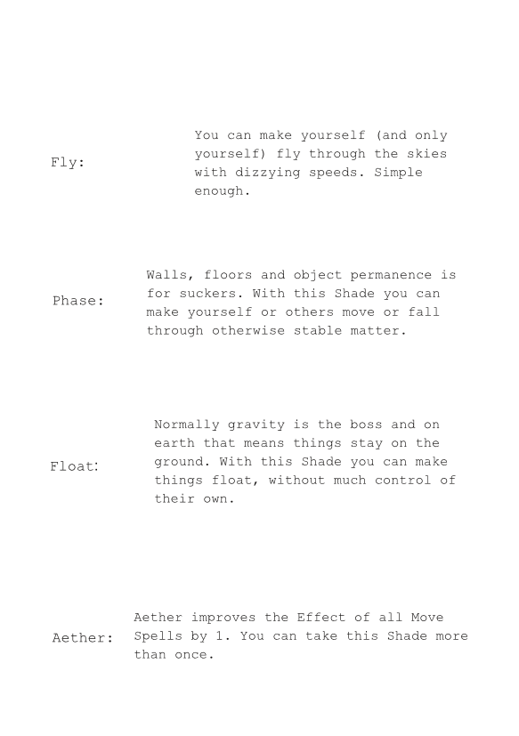](img/move.png)
# Character File
[Part 1](img/character_1.jpg)
[Part 2](img/character_2.jpg)
